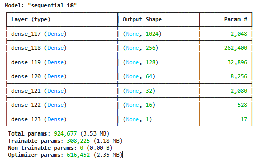
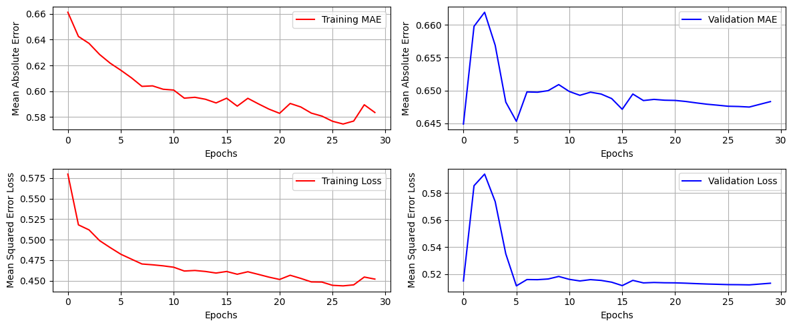
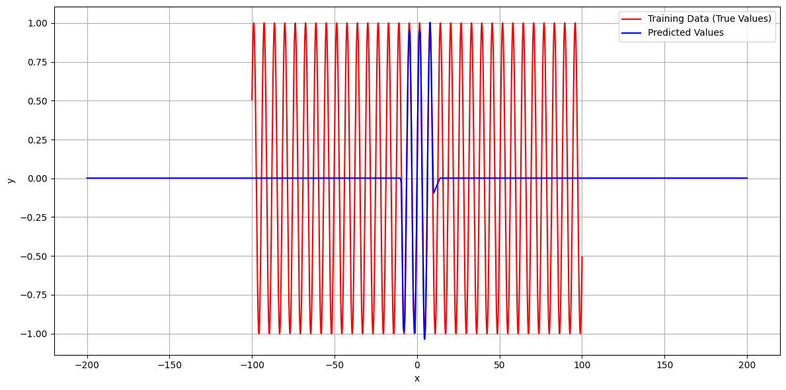

# Sine Function Approximation with 1M Parameter Neural Network (Without Regularization)

This project demonstrates a key lesson in deep learning: **bigger models don't always generalize better**. We trained a neural network with over **924,000 parameters** to simulate the sine function $\sin(x)$, but without any regularization techniques. The result is clear: **the model fits training data but fails to generalize**.

---

## 📁 Files Included

* `sin_use_924667_paramter_fail.py`: Main training script.
* `Module_summary.png`: Model architecture summary.
* `fit_resuts.png`: MAE and MSE over epochs (training & validation).
* `predict_results_to_test_generalization.png`: Comparison of predictions to true sine wave.

---

## 🏋️ Model Overview

* Input: 1D value $x \in [-100, 100]$
* Target: $y = \sin(x)$
* Architecture:

  * Dense(1024, relu)
  * Dense(256, relu)
  * Dense(128, relu)
  * Dense(64, relu)
  * Dense(32, relu)
  * Dense(16, relu)
  * Dense(1, linear)
* Total Parameters: `924,677`
* Optimizer: `adam`
* Loss: `mean_squared_error`

---

## 🎓 What Happened?

### ✅ Training Performance:

* Model shows good convergence on training data.
* MAE and MSE loss decreased significantly during training.

### ❌ Validation Performance:

* Despite low training error, validation error remained high.
* Model clearly **overfitted** the training range and failed to extrapolate.

---

## 🔍 Generalization Test

We extended the x-range to $[-200, 200]$ and plotted predictions vs. true values.
The result: the model predicts **flat zero** outside the training range.

> This is a classic failure due to **lack of regularization** and overparameterization.

---

## ❌ Lesson Learned

* Neural networks with high capacity can memorize but not generalize.
* Regularization (Dropout, L2, BatchNorm, etc.) is essential.
* For periodic functions like $\sin(x)$, architectures like **Fourier features** or **sinusoidal activations** work better.

---

## 🔹 Future Work

* Add `L2 regularization` or `Dropout`
* Try different activations (like `sin`, `tanh`)
* Explore Fourier feature mappings
* Reduce network size and increase generalization

---

## ✍️ Author

Documented by \[سعاده].
